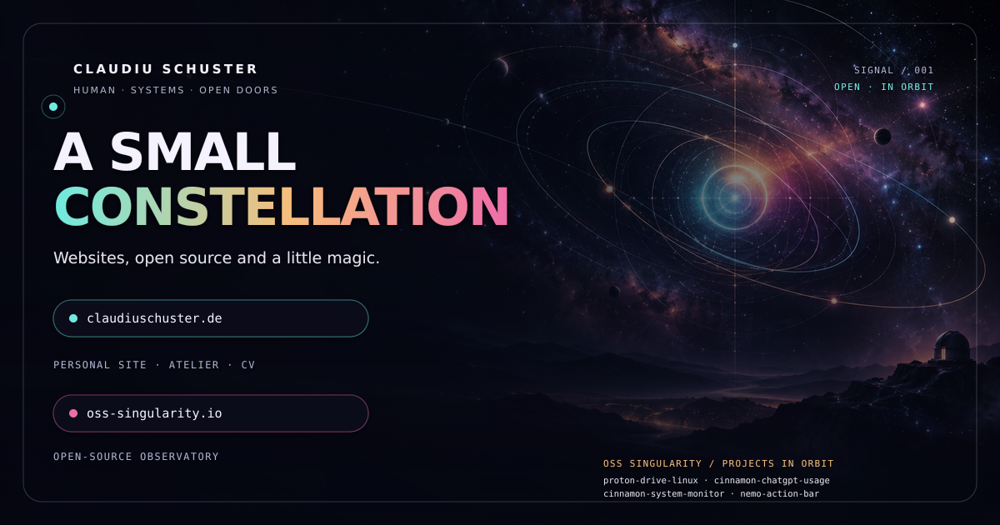

# claudiuschuster.github.io

 <strong>•</strong> 

A small constellation of websites, open-source work and curriculum vitae.

[Open the Constellation](https://claudiuschuster.github.io/)&nbsp;&nbsp;<strong>•</strong>&nbsp;&nbsp;[Visit claudiuschuster.de](https://claudiuschuster.de/)&nbsp;&nbsp;<strong>•</strong>&nbsp;&nbsp;[Explore OSS Singularity](https://oss-singularity.io/)&nbsp;&nbsp;<strong>•</strong>&nbsp;&nbsp;[Read the dev-docs](docs/README.md)

Built with love, care and a little magic for making complexity flow. 🫰🌈💎
